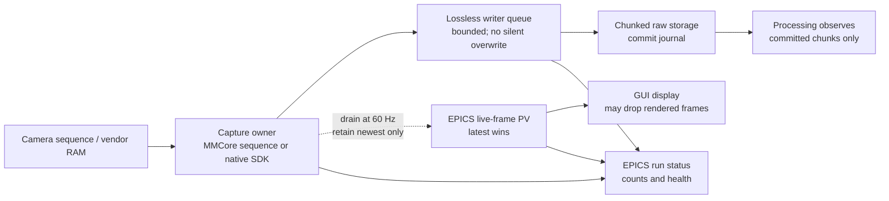

# Camera streaming and backpressure

Status: design decision record. The single-frame lossless service, MMCore
sequence-backed latest-frame live viewer, and finite list-scan backend API are
implemented. Durable streaming storage and live processing remain planned.

## Measured constraint

The current single-frame service issues one MMCore `snapImage()` call for each `TRIGGER`,
copies the array into a lossless shared-memory slot, hashes it, writes a frame
descriptor through EPICS, and waits for an exact acknowledgement before reuse.
This is the correct integrity boundary for a finite durable DPCT shot, but it
is not a continuous capture protocol.

| Camera configuration | Direct per-frame MDA | Per-frame Caproto | MMStudio RAM stream |
| --- | ---: | ---: | ---: |
| PVCAM FCS: 64x64, bin 2x2, 0.5 ms, 200 MHz 12-bit | 9.312 s / 2,000 | 26.113 s / 2,000 | 2.884 s / 2,000 |
| FLIR: 808x620, bin 2, Mono16, 2 ms, admitted 319.7536 Hz | 32.096 s / 160 | 33.813 s / 160 | 0.801 s / 160 |

For PVCAM, the synchronous EPICS descriptor/acknowledgement exchange adds
about 8.3 ms per frame. For FLIR, it adds about 10.1 ms per frame, but the
individual MMCore `snapImage()` call is the dominant limitation. The FLIR
MMStudio result proves that a stream-to-RAM mode is materially different from
the present per-shot path.

## Sequence retest with MMCore 12.5.0 / Device API 75

Camera-only retests on 2026-08-25 used no stage, illumination, storage, or
processing. The direct finite sequence is the list-scan API; the direct
continuous sequence and the IOC live run are the live-view API. Continuous
runs stop after draining at least the requested count, so their reported frame
count can be slightly larger than the target.

| Camera configuration | Path | Drained frames / elapsed | MMCore overrun | Comparison |
| --- | --- | ---: | ---: | --- |
| PVCAM FCS, partial property set | Prior per-frame `snapImage()` | 2,000 / 9.415 s | n/a | historical baseline |
| PVCAM FCS, partial property set | direct continuous MMCore sequence, 60 Hz drain | 2,001 / 9.225 s | 0 | incomplete configuration; not comparable to MMStudio |
| PVCAM FCS, verified full profile | direct continuous MMCore sequence, 60 Hz drain | 2,006 / 2.896 s | 0 | 0.4% slower than MMStudio |
| PVCAM FCS, verified full profile | IOC continuous live sequence, 60 Hz publish | 2,015 / 3.006 s | 0 | 4.2% over direct MMCore |
| PVCAM FCS, verified full profile | IOC continuous live sequence, 10 Hz publish | 2,065 / 3.125 s | 0 | 7.9% over direct MMCore; no gain from lower rate |
| PVCAM FCS, same settings | MMStudio RAM stream | 2,000 / 2.884 s | user-reported | reference |
| FLIR extreme, 808x620, bin 2, Mono16, 2 ms | Prior per-frame `snapImage()` | 160 / 32.038 s | n/a | baseline |
| FLIR extreme, same settings | `startSequenceAcquisition` finite list scan | 160 / 1.733 s | 0 | 18.5x faster than snap |
| FLIR extreme, same settings | direct continuous MMCore sequence, 60 Hz drain | 164 / 0.749 s | 0 | reaches 219 fps delivered |
| FLIR extreme, same settings | IOC continuous live sequence, EPICS latest image reads | 181 / 0.624 s | 0 | reaches 290 fps drained |
| FLIR extreme, same settings | MMStudio RAM stream | 160 / 0.801 s | user-reported | same performance class |

The FLIR result validates MMCore sequence acquisition as the live-view capture
path; a SpinnakerPy replacement is not warranted for that use case. The
previous 32-second result was specifically the synchronous per-frame
`snapImage()` path, not an MMCore throughput limit.

The earlier PVCAM result was not an MMCore or EPICS limitation: it omitted
admitted PVCAM settings. With the verified full profile, direct MMCore achieves
693 fps, essentially the 694 fps MMStudio reference. The 60 Hz IOC path achieves
670 fps and is within the 20% camera-to-RAM acceptance budget. Publishing at
10 Hz was marginally slower than 60 Hz (640 fps), so the default remains 60 Hz.
The experiment attributes the improvement to the complete profile as a whole;
it does not isolate a causal contribution from `ClearMode=Never` alone.

The reusable `--pvcam-fcs-profile` option loads the admitted `pvcam_base.cfg`
and then applies and reads back the validated FCS settings: 64x64 ROI, 2x2
binning, 0.5 ms exposure, 200 MHz 12-bit readout, 3-Sensitivity gain, internal
trigger, `ClearMode=Never`, zero clear cycles, and disabled disk/SMART/frame
summation/metadata/post-processing modes. This order matters: the legacy
`pvcam_fcs.cfg` assigns gain before the compatible readout mode is admitted by
the newer adapter.

The IOC drained every delivered frame at 60 Hz while intentionally publishing
only the newest frame. The benchmark's synchronous GUI-style reader received
203 PVCAM images in 9.364 s and 7 FLIR images in 0.624 s; its 1 MiB FLIR image
transfer cost is about 42 ms/read. This is acceptable for non-blocking preview
but establishes a separate GUI-delivery budget from camera capture.

## Present behavior

Implemented behavior is deliberately conservative:

- `SharedMemoryFrameRing` with `BufferUsage.ACQUISITION` is lossless. A full
  slot rejects the next trigger before the camera backend is asked to expose.
- A consumer may acknowledge a slot only after it has retained the exact
  descriptor's payload. This is required for durable DPCT acquisition.
- `FRAMES_DROPPED` currently counts rejected triggers at a full acquisition
  ring. It does **not** mean a vendor camera stream silently discarded a
  captured image.
- The Qt client retains its one-frame checksum-verifying acceptance action.
  Its separate live action must not poll `TRIGGER`; it starts one sequence and
  reads the bounded latest-frame EPICS contract instead.

The current `CameraServiceIOC` has one service-owned lossless acquisition ring
for single frames and a separate MMCore-sequence live path. The live path has a
byte-waveform frame PV and no service-owned shared-memory preview ring. It does
not yet own direct durable streaming storage. Processing workers consume
verified offline input; they do not observe a live camera feed.

## Proposed lane separation

The capture owner remains the only component that contacts the vendor driver.
For the initial live-view slice, the service publishes a bounded-rate,
latest-frame image value through EPICS. This is a preview-only data plane, not
the durable acquisition transport. Raw DPCT/FCS data continue to move through
the lossless writer and storage path rather than through per-frame EPICS PVs.

### Lossless writer lane

The acquisition process should start one finite or continuous vendor sequence,
drain frames in order, and submit them to a bounded writer queue. A writer
must persist data in chunks and atomically append a commit record before a
chunk is made available to processing. A crash may leave an uncommitted tail,
but must never make it appear committed.

The queue capacity is an explicit run setting based on frame size, native
driver buffering, storage latency, and RAM budget. At the FLIR extreme
configuration, each Mono16 frame is 1,001,920 bytes; the admitted 319.7536 Hz
rate is about 320 MB/s before copies and metadata. The 64x64 PVCAM FCS frame
is only 8 KiB as a uint16 array, but its high cadence still makes one durable
transaction per frame undesirable.

The acquisition lane is lossless only when all of the following are observed:

1. Vendor-reported acquired frames equal drained frames.
2. Drained frames equal persisted committed frames.
3. Sequence numbers are contiguous.
4. Every overrun, stop, or storage failure terminates the run with an explicit
   incomplete status rather than a fabricated complete stack.

If the writer queue fills, the policy must be explicit before hardware start:
stop the camera and fail the lossless run, or use an admitted vendor buffer
large enough for the known pause. Dropping an acquisition frame is not an
acceptable hidden fallback for reconstruction or correlation data.

### Preview lane

Live visualization does not need a second shared-memory ring. MMCore owns the
only circular buffer in this slice. The backend starts a continuous sequence
with `startSequenceAcquisition`, and one service task wakes at a default 60 Hz
cadence. On each wake it polls the MMCore buffer, pops every available frame to
keep that buffer draining, retains only the newest popped frame, and publishes
that frame and its metadata to EPICS. It never calls `snapImage()` for live
view.

The 60 Hz task must drain all queued MMCore frames, not pop just one. At the
admitted FLIR rate, a normal 16.7 ms wake can find five or six frames. Keeping
only the newest makes the older preview frames intentional skips while
preventing a vendor-ring overflow. The MMCore circular-buffer capacity and
poll-jitter budget are explicit live-profile settings; a vendor-ring overflow
is a fault, not a preview skip.

The live EPICS schema contains a bounded byte-waveform image PV plus immutable
metadata (`LIVE_SEQUENCE`, `LIVE_TIMESTAMP_NS`, `LIVE_SHAPE`, `LIVE_DTYPE`),
`LIVE_STATE`, and separate counters for camera frames drained, preview frames
published, preview frames intentionally skipped, and MMCore buffer overruns.
`LIVE_PUBLISH_HZ` defaults to 60 and is capped at 60 for this first slice.
The Qt client polls the latest image PV at its render cadence and renders its
most recent received frame; it does not send `TRIGGER`, open shared memory,
checksum the preview image, or acknowledge it.

Preview loss is normal and visible. Acquisition loss is exceptional and makes
the run incomplete. Reusing `FRAMES_DROPPED` for both would hide this
distinction, so the future streaming schema needs separate counters.

### Processing lane

Processing must consume immutable committed chunks from storage or an explicit
committed-chunk queue. It must not retain the capture ring, drive camera
backpressure, or require every raw frame to be reconstructed before the next
exposure. Correlation spectroscopy can use a separate low-latency consumer
only if it records which committed sequence range produced each result; its
work queue remains bounded and its lag must be observable.

## Implementation and decision gates

1. Completed: flatten the isolated `redsun_aht.buffers` package to
   `src/redsun_aht/buffers.py`, preserving its public imports and moving its
   tests with it. Apply the same flat-module rule to future unrelated
   single-file components; retain directories only for cohesive multi-file
   subsystems.
2. Completed: extend the MMCore backend protocol and fakes with circular-buffer setup,
   finite/continuous `startSequenceAcquisition`, image-count polling,
   `popNextImage`, overflow inspection, and idempotent stop. Benchmark direct
   sequence-to-RAM for each camera configuration, recording vendor, MMCore,
   drained, and overflow counts.
3. Completed: add a simulation-backed live sequence source and a `CameraServiceIOC` live
   mode. Its 60 Hz task drains the MMCore-style ring completely, retains the
   newest image only, and publishes that image and live counters through EPICS
   without `SharedMemoryFrameRing` or per-frame acknowledgement.
4. Completed: replace the GUI's repeated-one-frame live-view path with an EPICS
   latest-frame client. Verify that GUI rendering at or below 60 Hz neither blocks MMCore
   ring drainage nor issues `TRIGGER`/`snapImage()` calls.
5. Add chunked direct storage with commit/replay tests before allowing any real
   streaming run to write raw data. Preserve the existing lossless descriptor
   contract for finite DPCT until the storage lane supersedes it.
6. Only then attach detached processing to committed chunks and characterize
   its queue lag.

The live-view acceptance gate is a camera-only run with no stage, illumination,
storage, or processing: exactly one sequence start, zero `snapImage()` calls,
no MMCore buffer overrun, monotonically increasing live sequences, a maximum
60 Hz EPICS publication rate, and explicit accounting for every drained versus
published preview frame. The GUI may render fewer frames, but it must remain
responsive and cannot change the acquisition or drain rate.

The first acceptance targets are within 20% of the local MMStudio RAM results:
at most 3.461 s for PVCAM FCS 2,000 frames and 0.961 s for the FLIR extreme
160-frame case, with zero acquisition loss. These are camera-to-RAM targets;
storage and processing receive separate budgets and evidence.

The 2026-08-25 FLIR continuous result and the corrected PVCAM full-profile
continuous result both pass this camera-to-RAM gate. This establishes MMCore as
the current camera acquisition basis for the tested PVCAM FCS profile; durable
storage and processing still require their own evidence before use.

If Python MMCore sequence-to-RAM cannot approach the FLIR target while
MMStudio can, characterize a minimal SpinnakerPy sequence backend. Do not
replace MMCore merely to avoid Caproto: the measurements show that Caproto is
not the primary FLIR limit in the current single-snap path.
