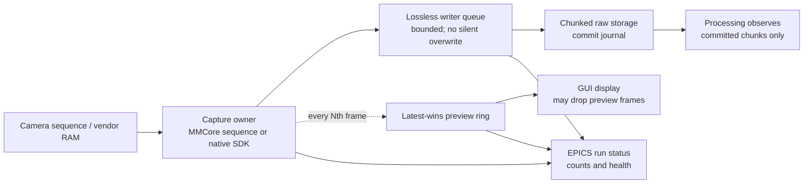

# Camera streaming and backpressure

Status: design decision record; the single-frame lossless service is
implemented, while continuous capture, preview sampling, and live processing
are planned.

## Measured constraint

The current service issues one MMCore `snapImage()` call for each `TRIGGER`,
copies the array into a lossless shared-memory slot, hashes it, writes a frame
descriptor through EPICS, and waits for an exact acknowledgement before reuse.
This is the correct integrity boundary for a finite durable DPCT shot, but it
is not a continuous capture protocol.

| Camera configuration | Direct per-frame MDA | Per-frame Caproto | MMStudio RAM stream |
| --- | ---: | ---: | ---: |
| PVCAM FCS: 64x64, bin 2x2, 0.5 ms, 200 MHz 12-bit | 9.312 s / 2,000 | 26.113 s / 2,000 | 2.884 s / 2,000 |
| FLIR: 808x620, bin 2, Mono16, 2 ms, admitted 319.7536 Hz | 32.096 s / 160 | 33.813 s / 160 | 0.801 s / 160 |

For PVCAM, the synchronous EPICS descriptor/acknowledgement exchange adds
about 8.3 ms per frame. For FLIR, it adds about 10.1 ms per frame, but the
individual MMCore `snapImage()` call is the dominant limitation. The FLIR
MMStudio result proves that a stream-to-RAM mode is materially different from
the present per-shot path.

## Present behavior

Implemented behavior is deliberately conservative:

- `SharedMemoryFrameRing` with `BufferUsage.ACQUISITION` is lossless. A full
  slot rejects the next trigger before the camera backend is asked to expose.
- A consumer may acknowledge a slot only after it has retained the exact
  descriptor's payload. This is required for durable DPCT acquisition.
- `FRAMES_DROPPED` currently counts rejected triggers at a full acquisition
  ring. It does **not** mean a vendor camera stream silently discarded a
  captured image.
- The Qt client is a one-frame checksum-verifying acceptance tool. It is not
  a live viewer and must not be turned into one by polling `TRIGGER`.

The current `CameraServiceIOC` has one acquisition ring and one latest
descriptor. It does not yet own a preview ring, a sequence-acquisition API,
or direct durable streaming storage. Processing workers consume verified
offline input; they do not observe a live camera feed.

## Proposed lane separation

The capture owner remains the only component that contacts the vendor driver.
EPICS remains the lifecycle/configuration/status plane, rather than a
per-frame data plane. Raw pixel data move through local memory and durable
storage, not through EPICS PV values.

### Lossless writer lane

The acquisition process should start one finite or continuous vendor sequence,
drain frames in order, and submit them to a bounded writer queue. A writer
must persist data in chunks and atomically append a commit record before a
chunk is made available to processing. A crash may leave an uncommitted tail,
but must never make it appear committed.

The queue capacity is an explicit run setting based on frame size, native
driver buffering, storage latency, and RAM budget. At the FLIR extreme
configuration, each Mono16 frame is 1,001,920 bytes; the admitted 319.7536 Hz
rate is about 320 MB/s before copies and metadata. The 64x64 PVCAM FCS frame
is only 8 KiB as a uint16 array, but its high cadence still makes one durable
transaction per frame undesirable.

The acquisition lane is lossless only when all of the following are observed:

1. Vendor-reported acquired frames equal drained frames.
2. Drained frames equal persisted committed frames.
3. Sequence numbers are contiguous.
4. Every overrun, stop, or storage failure terminates the run with an explicit
   incomplete status rather than a fabricated complete stack.

If the writer queue fills, the policy must be explicit before hardware start:
stop the camera and fail the lossless run, or use an admitted vendor buffer
large enough for the known pause. Dropping an acquisition frame is not an
acceptable hidden fallback for reconstruction or correlation data.

### Preview lane

Preview is a separate `BufferUsage.PREVIEW` latest-wins ring. It must never
hold a lossless writer slot or delay a camera read. A preview subscriber may
request a decimation ratio such as 1:10, so only frame sequences divisible by
ten are offered to the GUI. At FLIR's admitted rate this bounds preview offers
to about 32 Hz; GUI rendering may impose a lower cap.

Preview telemetry must distinguish camera frames acquired, lossless frames
persisted, preview candidates offered after decimation, preview frames
overwritten or skipped because the GUI is behind, and real acquisition
overruns or rejected starts.

Preview loss is normal and visible. Acquisition loss is exceptional and makes
the run incomplete. Reusing `FRAMES_DROPPED` for both would hide this
distinction, so the future streaming schema needs separate counters.

### Processing lane

Processing must consume immutable committed chunks from storage or an explicit
committed-chunk queue. It must not retain the capture ring, drive camera
backpressure, or require every raw frame to be reconstructed before the next
exposure. Correlation spectroscopy can use a separate low-latency consumer
only if it records which committed sequence range produced each result; its
work queue remains bounded and its lag must be observable.

## Implementation and decision gates

1. Benchmark direct CMMCorePlus finite/continuous sequence-to-RAM for each
   configuration, recording vendor, MMCore, and delivered sequence counts.
2. Add a simulation-only sequence source with separate acquisition and preview
   rings, lossless/preview counters, and full/backpressure tests.
3. Add chunked direct storage with commit/replay tests before allowing any real
   streaming run to write raw data.
4. Add 1:10 GUI preview sampling and verify it does not reduce the lossless
   capture rate or alter committed sequence continuity.
5. Only then attach detached processing to committed chunks and characterize
   its queue lag.

The first acceptance targets are within 20% of the local MMStudio RAM results:
at most 3.461 s for PVCAM FCS 2,000 frames and 0.961 s for the FLIR extreme
160-frame case, with zero acquisition loss. These are camera-to-RAM targets;
storage and processing receive separate budgets and evidence.

If Python MMCore sequence-to-RAM cannot approach the FLIR target while
MMStudio can, characterize a minimal SpinnakerPy sequence backend. Do not
replace MMCore merely to avoid Caproto: the measurements show that Caproto is
not the primary FLIR limit in the current single-snap path.
